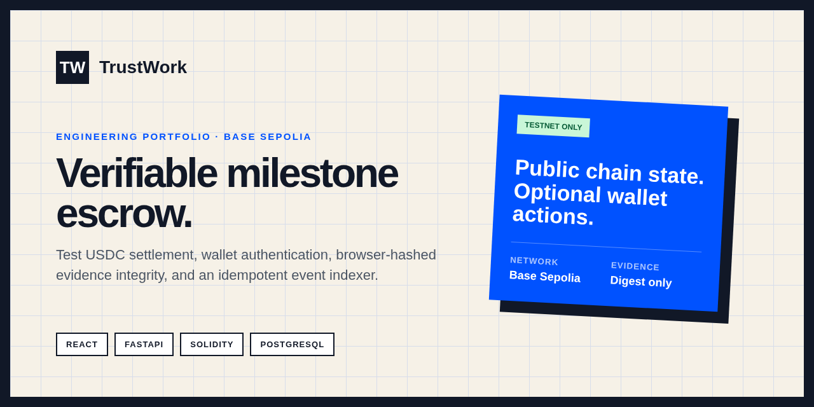
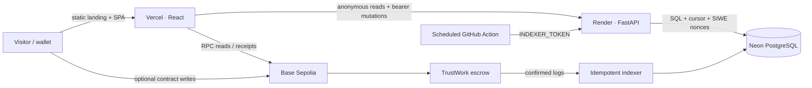

# TrustWork

> Verifiable milestone escrow for project work — running on Base Sepolia with test USDC.

[](https://github.com/salmoriadev/TrustWork/actions/workflows/ci.yml)
[](https://github.com/salmoriadev/TrustWork/actions/workflows/codeql.yml)


TrustWork is an early-access engineering portfolio project that combines a public read-only marketplace, wallet authentication, test USDC milestone escrow, evidence-integrity proofs, and event-derived reputation. Anonymous visitors can inspect indexed contracts; connecting a wallet is optional.

**Deployment status:** the dedicated Base Sepolia escrow is deployed and exact-match verified on Sourcify. API and frontend provider setup, public seed jobs, and the live smoke test are still pending, so no live application URL is published yet. See the [deployment record](docs/deployments/base-sepolia.md) and [deployment runbook](docs/deployment.md).



## Why this exists

Freelance agreements often blur scope, proof of delivery, and payment approval. TrustWork turns those boundaries into explicit milestones. A Solidity escrow preserves the financial state machine; a FastAPI indexer projects public chain state into a browsable product; original evidence content stays with the user while a digest proves integrity.

## Core flow

1. Browse already-indexed Base Sepolia contracts without a wallet.
2. Optionally connect an injected wallet or WalletConnect and sign an EIP-4361 message.
3. Create and fund milestones with official Base Sepolia test USDC.
4. Hash a file or note in the browser and submit the same `bytes32` digest to the API and escrow.
5. Follow the transaction through signature, submission, confirmation, BaseScan proof, and indexing.

## Architecture



## Feature status

| Capability | Status |
| --- | --- |
| Static, API-free landing at `/` | Implemented |
| Anonymous indexed marketplace at `/app` | Implemented; needs deployed seed contracts |
| Injected wallet + WalletConnect session | Implemented |
| Base Sepolia enforcement and add/switch flow | Implemented |
| EIP-4361 challenge, replay protection, in-memory bearer token | Implemented |
| Receipt, replacement, revert, BaseScan, and indexing states | Implemented |
| Browser-side SHA-256 evidence integrity proofs | Implemented |
| Persistent confirmed-block cursor and scheduled reconciliation | Implemented |
| Encrypted private file hosting | Roadmap — not represented as live |
| Mainnet / real-money usage | Out of scope |
| External smart-contract audit | Not completed |

## Quick preview

```bash
cd frontend && npm ci
npm run dev
```

Open `http://localhost:5173`. The landing page performs no API or wallet initialization. `/app` expects a configured API; local fixtures are available only in Vite development mode when `VITE_ENABLE_DEMO_DATA=true`.

## Reproducible local stack

Prerequisites: Node 20, Python 3.12, [uv](https://docs.astral.sh/uv/), Docker, and Foundry 1.7.1.

```bash
cp .env.example .env
docker compose up -d postgres
cd backend && uv sync --extra dev --locked && uv run alembic upgrade head
uv run uvicorn app.main:app --reload
```

In another terminal:

```bash
cd frontend && npm ci && npm run dev
```

For the complete local contract flow, run `./demo.sh` after configuring the local deployment values documented in [contracts/README.md](contracts/README.md).

## Technical highlights

- Solidity state machine with milestone funding, approval, revision, disputes, timeouts, mutual cancellation, caps, roles, pausing, and reentrancy protection.
- SIWE-compatible authentication with hashed single-use nonces, strict domain/URI/chain checks, short-lived HS256 access tokens, and server-derived actors.
- PostgreSQL event projection with idempotent log identity, a persistent confirmed cursor, and a replay window.
- Evidence privacy boundary: no evidence body crosses the API; only digest, filename, media type, size, job reference, and verified uploader are stored.
- A single EIP-1193 wallet session powers signing and every contract write.
- Production security headers, strict CORS, trusted hosts, provider-only secrets, CodeQL, Trivy, npm audit, pip-audit, Slither, Foundry, SBOM, and schema gates.

## Testing

```bash
./scripts/check.sh
```

The CI matrix runs backend unit/integration tests, Alembic migrations, frontend tests and production builds, Foundry unit/fuzz/invariant suites, Slither, dependency audits, secret/IaC/image scanning, generated API contract checks, and SBOM generation.

## Smart contract

- Network: Base Sepolia (`84532`)
- Token: official Base Sepolia USDC (`0x036CbD53842c5426634e7929541eC2318f3dCF7e`)
- Escrow: [`0xCB9A7C320a46fa8FA091C7E74DD192df2fb6Ce81`](https://sepolia.basescan.org/address/0xCB9A7C320a46fa8FA091C7E74DD192df2fb6Ce81)
- Deployment transaction: [`0x666ef368…68b7b9`](https://sepolia.basescan.org/tx/0x666ef36845f536f190228f934453a1a3b694de1669e3614b8444f7f36268b7b9)
- Deployment block: `45824805`
- Verification: [Sourcify exact match](https://sourcify.dev/server/v2/verify/21331f04-8adc-4430-8576-fdb03478df7a)

No local Anvil address or fabricated transaction is presented as a public deployment.

## Security and limitations

- Testnet only; test ETH and test USDC have no monetary value.
- Not commercially available and not suitable for real funds.
- The escrow has not received an external security audit.
- TrustWork does not host private files; encrypted storage is a roadmap item.
- Free hosting can sleep or enforce quotas; the UI uses bounded wake-up retries and a clear failure state.
- Review [SECURITY.md](SECURITY.md) before reporting a vulnerability.

## Documentation

Start with the [documentation index](docs/README.md), then use the [deployment runbook](docs/deployment.md) for Neon, Base Sepolia, Render, Vercel, rollback, and smoke tests.

## Roadmap

- Create and index the public Base Sepolia seed jobs.
- Publish the Vercel and Render URLs after live smoke tests.
- Add encrypted user-controlled evidence storage as a separately threat-modeled capability.
- Commission an independent smart-contract audit before considering any mainnet path.

Built by [Arthur Salmoria](https://github.com/salmoriadev). Released under the [MIT License](LICENSE).
