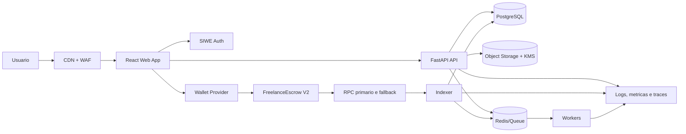

# Arquitetura-Alvo de Producao

## Principios

1. A blockchain e a fonte da verdade financeira; PostgreSQL e uma projecao reconstruivel.
2. Toda mutacao off-chain exige identidade autenticada e autorizacao contextual.
3. Evidencia privada nunca e publicada diretamente; on-chain recebe apenas um compromisso
   criptografico canonico.
4. O frontend nao declara uma transacao concluida antes de receipt confirmado e indexado.
5. Nenhum processo HTTP publico executa trabalho pesado de indexacao sincronamente.
6. Componentes criticos falham de forma observavel e recuperavel.

## Componentes



## Fronteiras de confianca

| Fronteira | Dados aceitos | Validacao obrigatoria |
| --- | --- | --- |
| Browser -> API | JWT/cookie, payload, arquivos | SIWE, CSRF conforme sessao, schema, rate limit e RBAC. |
| Browser -> wallet | Transacao e mensagem | chain ID, contrato, simulacao e resumo humano. |
| API -> object storage | Evidencia cifrada | chave por objeto, checksum, MIME, tamanho e malware scan. |
| RPC -> indexador | Blocos e logs | chain ID, endereco, confirmacoes, block hash e reorg. |
| Indexador -> PostgreSQL | Eventos decodificados | idempotencia, cursor e transacao atomica. |
| Operador -> admin | Pause, roles e deploy | multisig, hardware wallet, timelock e trilha de auditoria. |

## Contratos de dados

### Valores on-chain

- `uint256`, IDs, valores brutos e block numbers sao strings decimais em JSON.
- Enderecos sao validados como hex de 20 bytes e normalizados em checksum na borda Web3.
- O banco usa `NUMERIC(78, 0)` para `uint256`.
- O frontend usa `bigint` somente em chamadas Viem e formatadores explicitos.
- Nenhum valor monetario passa por ponto flutuante.

Exemplo:

```json
{
  "job_id": "18446744073709551617",
  "total_amount_raw": "4800000000",
  "chain_id": 8453
}
```

### Manifesto de evidencia

O hash on-chain deve ser calculado sobre um manifesto canonico versionado, nao sobre o nome do
arquivo nem sobre um texto digitado manualmente.

```json
{
  "version": 1,
  "job_id": "<uuid>",
  "milestone_id": "<uuid>",
  "uploader": "0x...",
  "object_sha256": "<64 hex>",
  "size_bytes": 1234,
  "content_type": "application/pdf",
  "created_at": "<UTC ISO-8601>"
}
```

O JSON e serializado de forma canonica; seu compromisso e calculado uma vez, retornado pela API e
enviado diretamente como `bytes32`. A verificacao reconstroi o manifesto e compara o compromisso.

## Fluxo de autenticacao

1. Cliente solicita nonce de uso unico.
2. API cria mensagem SIWE com dominio, URI, chain ID, nonce, issued-at e expiration-time.
3. Wallet assina a mensagem.
4. API valida formato, origem, assinatura EOA ou ERC-1271, nonce e prazo.
5. API cria sessao curta e refresh token rotativo, vinculados ao endereco.
6. Toda mutacao deriva o ator da sessao; payload nao escolhe `actor_wallet`.
7. Troca de conta ou rede invalida/revalida a sessao.

Referencia: [ERC-4361](https://eips.ethereum.org/EIPS/eip-4361).

## Fluxo de transacao

1. API prepara somente dados deterministas; nao assina pelo usuario.
2. Frontend valida chain, endereco de contrato e papel do usuario.
3. Public client simula a chamada e estima gas.
4. Wallet client envia a transacao.
5. UI registra estado `awaiting_signature`, `submitted`, `confirming`, `confirmed` ou `failed`.
6. Public client aguarda receipt com politica de confirmacoes do ambiente.
7. Backend/indexador confirma a projecao.
8. UI reconcilia receipt e projecao; divergencia abre alerta operacional.

## Fluxo do indexador

1. Cursor persistente guarda chain, contrato, ultimo bloco e block hash.
2. Worker consulta somente ranges limitados ate `latest - confirmations`.
3. Eventos e cursor sao gravados na mesma transacao de banco.
4. Block hashes recentes sao revistos para detectar reorg.
5. Reorg reverte projecoes afetadas ou dispara rebuild deterministico.
6. Publicacao em fila usa outbox transacional; falha do Redis nao perde o evento.
7. Replay administrativo e autenticado, paginado, observavel e idempotente.

## Ambientes

| Ambiente | Chain | Fundos | Dados | Finalidade |
| --- | --- | --- | --- | --- |
| Local | Anvil | MockUSDC | Sinteticos | Desenvolvimento e testes. |
| CI | Anvil/Postgres efemeros | MockUSDC | Fixtures | Validacao reproduzivel. |
| Staging | Base Sepolia | USDC de teste | Usuarios internos | E2E e UAT. |
| Beta | Base Mainnet | USDC real com caps | Usuarios convidados | Validacao controlada. |
| Producao | Base Mainnet | USDC real | Usuarios aprovados | Operacao comercial. |

O endereco de token e sempre configurado por ambiente e validado contra a lista oficial da Circle:
[USDC contract addresses](https://developers.circle.com/stablecoins/usdc-contract-addresses).
