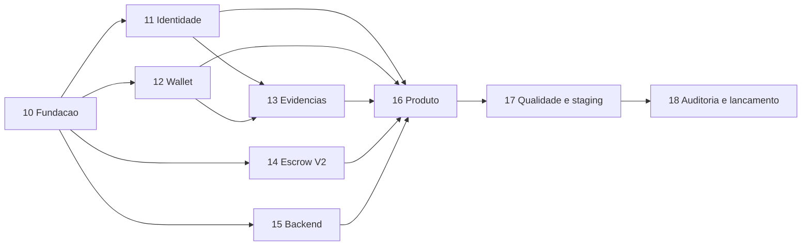

# Roadmap de Producao

## Objetivo

Levar o TrustWork do estado atual ate um rollout comercial controlado em Base Mainnet. O roadmap
prioriza reducao de risco: identidade e integridade antes de conveniencia, saidas de fundos antes
de growth e operacao antes de escala.

## Premissas

- Equipe de referencia: 2-3 engenheiros experientes com apoio de produto/design, DevOps e juridico.
- Estimativas sao faixas de esforco, nao promessa de calendario.
- Auditoria externa e parecer juridico possuem agenda propria.
- Fases podem sobrepor apenas quando a dependencia estiver explicitamente satisfeita.
- Mainnet usa caps e allowlist ate existir evidencia operacional suficiente.

## Sequencia

## Fases e marcos

Os checklists abaixo possuem playbooks detalhados em
[Planos de Execucao](execucao/README.md). A especificacao define o que a fase entrega; o playbook
define a ordem, a evidencia e quando cada tarefa pode ser marcada.

| Fase | Esforco indicativo | Dependencias | Marco |
| --- | ---: | --- | --- |
| 10 - Fundacao confiavel | 1-2 semanas | Nenhuma | CI reproduzivel e tipos on-chain seguros. |
| 11 - Identidade e autorizacao | 2-3 semanas | 10 | API nao confia em wallet declarada. |
| 12 - Wallet e transacoes | 2-3 semanas | 10 | QR/injected funcionam com receipts reais. |
| 13 - Evidencias privadas | 2-4 semanas | 11, 12 | Arquivo privado verificavel de ponta a ponta. |
| 14 - Escrow V2 | 4-6 semanas | 10 + decisoes de negocio | Fundos possuem saidas e termos imutaveis. |
| 15 - Backend e indexador | 3-5 semanas | 10 | Projecao resiliente e operavel. |
| 16 - Produto comercial | 4-6 semanas | 11-15 | Jornadas completas por papel. |
| 17 - Qualidade e staging | 3-4 semanas | 16 | Beta Sepolia observavel e aprovado. |
| 18 - Auditoria e lancamento | 4-8+ semanas | 17 | Mainnet limitada e comercializavel. |

## Atalhos de execucao

| Onda | Playbooks |
| --- | --- |
| Fundacao | [Fase 10](execucao/FASE-10.md) |
| Riscos estruturais | [Fase 11](execucao/FASE-11.md), [Fase 12](execucao/FASE-12.md), [Fase 14](execucao/FASE-14.md), [Fase 15](execucao/FASE-15.md) |
| Integridade e produto | [Fase 13](execucao/FASE-13.md), [Fase 16](execucao/FASE-16.md) |
| Prova operacional | [Fase 17](execucao/FASE-17.md) |
| Auditoria e venda | [Fase 18](execucao/FASE-18.md) |

Com paralelizacao responsavel, a meta e 12-20 semanas para um beta tecnicamente pronto e mais
tempo conforme auditoria, compliance e aprendizados do beta. Um desenvolvedor solo deve planejar
prazo substancialmente maior.

## Rastreabilidade dos bloqueadores

| Bloqueador do diagnostico | Fase primaria | Evidencia de encerramento |
| --- | --- | --- |
| B-01 Identidade declarativa | 11 | Suite SIWE/RBAC e pentest de autorizacao. |
| B-02 WalletConnect desconectado | 12 | Matriz QR/injected com receipts reais. |
| B-03 Perda de precisao de IDs | 10 | E2E com `uint256` acima do limite seguro JS. |
| B-04 Hash de evidencia inconsistente | 13 | Verificacao arquivo-manifesto-on-chain. |
| B-05 Estado de transacao enganoso | 12 | Testes de receipt, revert e replacement. |
| B-06 Indexador publico/sem cursor | 15 | Replay, reorg e falhas injetadas. |
| B-07 Saidas economicas incompletas | 14 | Invariantes e especificacao do Escrow V2. |
| B-08 Dependencias vulneraveis | 10 e continuo | Scan runtime sem finding alto aberto. |
| Ausencia de jornadas comerciais | 16 | UAT de cliente, freelancer e arbitro. |
| Ausencia de prova operacional | 17 | Duas semanas de staging e game days. |
| Auditoria/compliance ausentes | 18 | Relatorios, pareceres e Gate G2. |

## Ondas de execucao

### Onda A: remover riscos estruturais

- Fase 10 completa.
- Fases 11, 12, 14 e 15 podem iniciar em paralelo com proprietarios diferentes.
- Decisoes juridicas/economicas da Fase 14 comecam imediatamente, mesmo que a implementacao venha
  depois.

### Onda B: fechar a proposta de valor

- Fase 13 usa identidade e wallet consolidadas.
- Fase 16 integra os componentes em jornadas reais.
- Nenhum mock silencioso permanece no build de staging/producao.

### Onda C: provar operacao

- Fase 17 executa E2E repetido em Base Sepolia com usuarios internos e convidados.
- Falhas de transacao, RPC, indexador, storage e notificacao sao exercitadas deliberadamente.

### Onda D: reduzir risco residual e vender

- Fase 18 congela o contrato, executa auditoria, pentest e compliance.
- Mainnet inicia com allowlist, caps baixos, suporte proximo e criterios de rollback/pausa.

## Caminho critico

1. Decisao sobre modelo juridico, custodia, arbitragem e fees.
2. Redesign e auditoria do Escrow V2.
3. SIWE/autorizacao e evidencias privadas.
4. E2E de funding ate payout em staging.
5. Operacao, suporte e resposta a incidente.

Adicionar features de growth antes desses itens aumenta superficie de risco e nao aproxima o
produto de uma venda segura.

## Governanca do roadmap

- Status permitidos: `nao iniciada`, `em andamento`, `bloqueada`, `em validacao`, `concluida`.
- Cada fase possui um responsavel e um aprovador diferente quando envolve seguranca financeira.
- Mudanca de escopo no contrato apos auditoria invalida o gate de auditoria.
- Findings P0/P1 geram fase de remediacao antes de avancar.
- Debitos aceitos possuem owner, prazo e justificativa; "corrigir depois da mainnet" nao e aceite.
